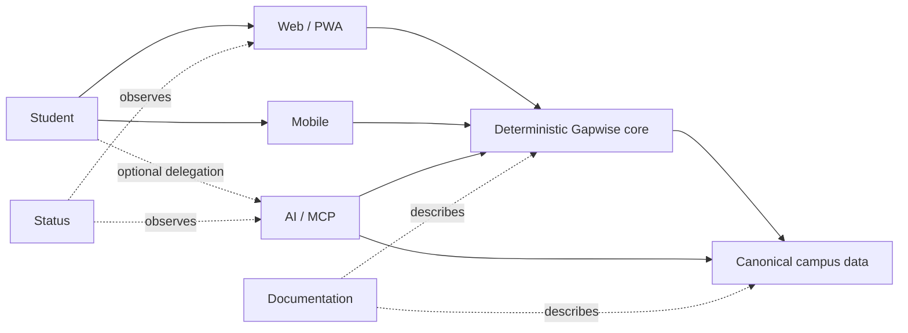

# Gapwise

### Make the time between classes count.

**Privacy-first campus intelligence for the University of Toronto Mississauga.**

 

**Local-first · deterministic where correctness matters · explicit about trust boundaries**

---

Gapwise turns a UTM timetable into a model of the day around it: **what is next, how much usable time exists between classes, where a student can realistically go, when they need to leave, and how certain the underlying campus information is.**

The original ACORN calendar is parsed locally in the browser. Timetable arithmetic, routing, travel time, gap budgets, destination feasibility, and leave-by calculations are deterministic rather than delegated to a language model.

## The ecosystem

| Repository | Owns | Surface |
| --- | --- | --- |
| **[`gapwise`](https://github.com/Gapwise-for-UTM/gapwise)** | Core web/PWA product, student-state behavior, deterministic campus engine, public API and SDK source | [gapwise.ca](https://gapwise.ca) · [api.gapwise.ca](https://api.gapwise.ca/v1) |
| **[`gapwise-mobile`](https://github.com/Gapwise-for-UTM/gapwise-mobile)** | Native iOS and Android client consuming canonical Gapwise contracts | Mobile |
| **[`gapwise-ai`](https://github.com/Gapwise-for-UTM/gapwise-ai)** | OAuth/MCP boundary for explicitly delegated student context and bounded AI actions | [ai.gapwise.ca](https://ai.gapwise.ca) |
| **[`gapwise-data`](https://github.com/Gapwise-for-UTM/gapwise-data)** | Canonical public UTM campus data, provenance, schemas and validation | [data.gapwise.ca](https://data.gapwise.ca) |
| **[`gapwise-docs`](https://github.com/Gapwise-for-UTM/gapwise-docs)** | Public developer documentation for APIs, SDKs, data, security and AI/MCP | [docs.gapwise.ca](https://docs.gapwise.ca) |
| **[`gapwise-status`](https://github.com/Gapwise-for-UTM/gapwise-status)** | Independent service-health monitoring and incident communication | [status.gapwise.ca](https://status.gapwise.ca) |

### One source of truth per responsibility

**Gapwise owns deterministic student-day semantics. `gapwise-data` owns shared campus facts. `gapwise-docs` documents released contracts. `gapwise-status` observes public services. AI consumes bounded context; it does not become a second timetable or routing engine.**

## Engineering principles

| | Principle | What it means |
| --- | --- | --- |
| **01** | **Privacy first** | Collect, transmit and retain less student information. Keep trust boundaries narrow and explicit. |
| **02** | **Deterministic core** | Schedules, routes, durations, feasibility and leave-by timing must be reproducible. |
| **03** | **Canonical facts** | Shared campus information has one owner, with provenance and visible uncertainty. |
| **04** | **Local where practical** | Keep useful functionality available without unnecessary network dependencies. |
| **05** | **Interfaces consume truth** | Web, mobile, APIs and AI should not silently recreate domain behavior. |
| **06** | **Useful over complicated** | Architecture exists to improve a student's day, not to make the diagram larger. |

## Developer surfaces

- **API:** [`api.gapwise.ca/v1`](https://api.gapwise.ca/v1)
- **OpenAPI:** [`api.gapwise.ca/openapi.json`](https://api.gapwise.ca/openapi.json)
- **Documentation:** [`docs.gapwise.ca`](https://docs.gapwise.ca)
- **Campus data:** [`data.gapwise.ca`](https://data.gapwise.ca)
- **JavaScript / TypeScript SDK:** `@gapwise/sdk`
- **Security:** [`security@gapwise.ca`](mailto:security@gapwise.ca)
- **Support:** [`support@gapwise.ca`](mailto:support@gapwise.ca)

## Contributing

Choose the repository that owns the behavior you want to change. Shared contribution, security, support and pull-request guidance lives in this organization's [`.github`](https://github.com/Gapwise-for-UTM/.github) repository and is inherited by repositories that do not provide a more specific policy.

Campus facts and routing evidence belong in **`gapwise-data`**. Product behavior belongs in **`gapwise`**. Public documentation belongs in **`gapwise-docs`**. Keep changes focused and preserve the source-of-truth boundary.

---

**Independent student software. Not affiliated with or endorsed by the University of Toronto.**

 

**Built for the spaces between classes.**

