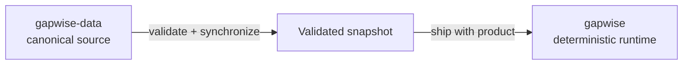
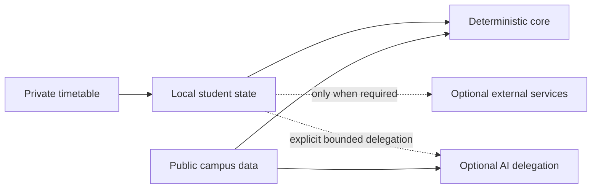

<div align="center">

<br>


# Gapwise

### Make the time between classes count.

**Privacy-first campus intelligence for the University of Toronto Mississauga.**

<br>

<a href="https://gapwise.ca">
  
</a>
&nbsp;
<a href="https://docs.gapwise.ca">
  
</a>
&nbsp;
<a href="mailto:support@gapwise.ca">
  
</a>

<br><br>


<br><br><br>

### Your timetable tells you **when** class starts.

### Gapwise helps you understand **everything in between.**

<br>

</div>

---

<div align="center">

## Campus intelligence for the part of your day a timetable ignores.

</div>

A timetable gives you **times** and **rooms**.

But between those classes, students have a different problem:

> ### “I have time before my next class. What can I realistically do?”

Gapwise connects your schedule with campus context to answer that question.

It is built around four pieces of information:

<table>
<tr>
<td width="25%" align="center" valign="top">

### ◷ Time

**How much usable time do you actually have?**

A two-hour gap is not always two hours of free time.

</td>
<td width="25%" align="center" valign="top">

### ◇ Place

**Where are you now, and where do you need to be?**

Campus context gives time meaning.

</td>
<td width="25%" align="center" valign="top">

### → Movement

**How long will getting there realistically take?**

Travel time belongs in the calculation.

</td>
<td width="25%" align="center" valign="top">

### ✦ Opportunity

**What actually fits before your next commitment?**

The useful answer depends on the time that remains.

</td>
</tr>
</table>

<br>

<div align="center">

### Schedule + campus data + routing + context

## ↓

### A better understanding of your day.

</div>

<br>

---

<div align="center">

## Built for the gaps

**The useful part of a schedule is not just what happens next.  
It is what is possible before it happens.**

</div>

<br>

<table>
<tr>
<td width="50%" valign="top">

### ◷ Understand your time

A gap between classes has a nominal duration.

What matters is the **usable duration**.

Gapwise considers where you need to be next and the movement required to reach it, producing a more useful picture of the time you actually have.

</td>
<td width="50%" valign="top">

### ◇ Navigate intelligently

Routes, distances, leave-by times, and gap feasibility have algorithmic answers.

Gapwise keeps those calculations deterministic and reproducible.

**If ordinary code can calculate it reliably, AI does not guess it.**

</td>
</tr>

<tr>
<td width="50%" valign="top">

### ✦ Discover what fits

A twenty-minute gap and a three-hour gap are fundamentally different opportunities.

Gapwise can combine available time with campus context to help surface useful places, activities, spaces, and resources that realistically fit.

</td>
<td width="50%" valign="top">

### ⛨ Protect your routine

A timetable can reveal a meaningful amount about someone's life.

Gapwise is designed to minimize unnecessary collection, storage, and transmission of student information.

**The safest unnecessary data is data never collected.**

</td>
</tr>
</table>

---

<div align="center">

# One product.

### Focused components. Clear responsibilities. One shared model of campus truth.

</div>

<br>

| Repository | Responsibility |
|:---|:---|
| **[`gapwise`](https://github.com/Gapwise-for-UTM/gapwise)** | **Core Web / PWA** — timetable import, student state, Today, gaps, deterministic routing, leave-by calculations, campus exploration, API contracts, and the main Gapwise experience. |
| **[`gapwise-mobile`](https://github.com/Gapwise-for-UTM/gapwise-mobile)** | **Native Client** — first-party iOS and Android experience with platform-specific integrations and secure local storage. |
| **[`gapwise-ai`](https://github.com/Gapwise-for-UTM/gapwise-ai)** | **AI & MCP Interfaces** — provider-neutral natural-language interfaces for tasks where interpretation and delegated context are useful. |
| **[`gapwise-data`](https://github.com/Gapwise-for-UTM/gapwise-data)** | **Canonical Campus Data** — shared UTM buildings, geometry, entrances, routing graph data, provenance, validation, and reusable campus datasets. |
| **[`gapwise-docs`](https://github.com/Gapwise-for-UTM/gapwise-docs)** | **Documentation** — architecture, API guidance, contracts, privacy boundaries, specifications, and public developer documentation. |
| **[`gapwise-status`](https://github.com/Gapwise-for-UTM/gapwise-status)** | **Independent Status** — service-health and operational communication kept separate from the systems it monitors. |

<br>

<div align="center">

<a href="https://github.com/Gapwise-for-UTM/gapwise">
  
</a>
&nbsp;
<a href="https://github.com/Gapwise-for-UTM/gapwise-data">
  
</a>
&nbsp;
<a href="https://github.com/Gapwise-for-UTM/gapwise-docs">
  
</a>

</div>

<br>

---

<div align="center">

# Architecture

### Simple where it can be. Strict where it matters.

</div>

```mermaid
flowchart TB
    Student["Student"]

    subgraph Clients["Gapwise clients"]
        Web["Web / PWA"]
        Mobile["Native mobile"]
        AI["AI / MCP interfaces"]
    end

    Core["Deterministic core
    Schedule · gaps · routing · feasibility"]

    Data["gapwise-data
    Canonical UTM campus facts"]

    Docs["gapwise-docs
    Architecture · contracts · guidance"]

    Status["gapwise-status
    Independent service health"]

    Student --> Web
    Student --> Mobile
    Student -. "optional delegation" .-> AI

    Web --> Core
    Mobile --> Core
    AI --> Core

    Core --> Data
    AI --> Data

    Docs -. "documents" .-> Core
    Docs -. "documents" .-> Data
    Docs -. "documents" .-> AI

    Web -. "health" .-> Status
    Mobile -. "health" .-> Status
    AI -. "health" .-> Status
````

<div align="center">

`gapwise-docs` describes the system.

`gapwise-status` observes the system.

Neither belongs in the critical runtime path of the product itself.

</div>

<br>

---

<div align="center">

## Three rules shape the architecture.

</div>

<table>
<tr>
<td width="33%" align="center" valign="top">

### 01

## Compute

**Deterministic when correctness matters.**

Schedules, durations, routes, distances, feasibility, and leave-by times should produce reproducible results.

</td>
<td width="33%" align="center" valign="top">

### 02

## Interpret

**AI when interpretation helps.**

Natural language, explanation, discovery, and contextual reasoning benefit from flexible interfaces.

</td>
<td width="33%" align="center" valign="top">

### 03

## Minimize

**Collect only what is necessary.**

Every service must justify the student information it receives.

</td>
</tr>
</table>

<br>

<div align="center">

### Algorithms for facts that can be computed.

### AI for context that can be interpreted.

### Privacy for everything.

</div>

---

## Deterministic when correctness matters

Gapwise treats ordinary computation as ordinary computation.

Timetable calculations, gap durations, route selection, destination feasibility, travel times, and leave-by calculations should not depend on probabilistic text generation.

> ### AI does not calculate what ordinary code can calculate reliably.

This creates an important boundary:

```text
known inputs
    ↓
deterministic computation
    ↓
reproducible result
```

Not:

```text
known inputs
    ↓
ask a language model
    ↓
hope the arithmetic is right
```

The distinction is intentionally boring.

**Correct infrastructure often should be.**

---

## AI when interpretation helps

AI belongs where flexibility creates value.

That can include:

* natural-language interaction;
* interpreting a student's stated intention;
* explaining deterministic results;
* contextual discovery;
* translating structured information into useful language.

It does **not** become the source of truth for calculations that already have deterministic answers.

<div align="center">

### The model may explain the answer.

## It does not invent the answer.

</div>

---

<div align="center">

# One canonical home for campus truth

### Shared UTM facts belong in `gapwise-data`.

</div>

Gapwise has multiple clients.

It should not have multiple conflicting versions of the University of Toronto Mississauga.

Canonical public campus information belongs in **[`gapwise-data`](https://github.com/Gapwise-for-UTM/gapwise-data)**:

* building identity;
* building geometry;
* entrances;
* routing graph data;
* campus locations;
* evidence and provenance;
* generated campus artifacts;
* schemas and validation.

Clients may consume validated snapshots for reliability.

They should not quietly invent independent copies of shared campus truth.

<div align="center">

## One fact → one canonical source.

</div>

---

## Reliability without runtime coupling

Canonical data ownership does not mean every request needs GitHub or `data.gapwise.ca` to be online.

The core product can consume a validated snapshot of canonical campus data so deterministic routing remains available without introducing a network dependency into the routing path.



<div align="center">

### Canonical ownership.

### Local runtime reliability.

### No unnecessary network dependency.

</div>

---

<div align="center">

# Privacy by architecture

### Your timetable describes your routine.

## Gapwise treats it accordingly.

</div>

Gapwise is designed around **data minimization**, **local processing where practical**, and **explicit trust boundaries**.

> ### If a service does not need a piece of student data, it should not receive it.

That means designing toward:

* local timetable parsing where practical;
* guest-first usefulness;
* minimal transmission of student state;
* narrowly scoped external integrations;
* explicit boundaries between public campus data and private student data;
* separation between deterministic systems and probabilistic interfaces;
* avoiding storage merely because storage is technically possible;
* keeping privileged secrets out of browser and mobile clients;
* making uncertainty visible instead of fabricating confidence.

Privacy is not an extra layer applied after the product is built.

### It is one of the constraints the product is built around.

---

<div align="center">

## Trust boundaries

</div>



The goal is not to pretend that every feature can exist entirely offline.

The goal is to make every boundary **intentional, narrow, understandable, and justified**.

---

<div align="center">

# Principles

</div>

<table>
<tr>
<td width="33%" align="center" valign="top">

### ⛨ Privacy first

Collect less.

Transmit less.

Store less.

Keep trust boundaries small.

</td>
<td width="33%" align="center" valign="top">

### ◇ Deterministic core

Use algorithms for problems with algorithmic answers.

Correctness should be reproducible.

</td>
<td width="33%" align="center" valign="top">

### ⌂ Local where practical

Keep student information on the student's device whenever doing so makes sense.

</td>
</tr>

<tr>
<td width="33%" align="center" valign="top">

### ⎇ Clear boundaries

Every component should have a clear reason to exist.

A new surface does not automatically require a new service.

</td>
<td width="33%" align="center" valign="top">

### ◎ One source of truth

Shared campus information should be canonical, validated, and reusable.

</td>
<td width="33%" align="center" valign="top">

### ✦ Useful over complicated

Technology exists to make a student's day better.

Not to make the architecture diagram bigger.

</td>
</tr>
</table>

---

<div align="center">

# The Gapwise surfaces

</div>

<br>

<table>
<tr>
<td width="50%" valign="top">

### Gapwise

**The student product.**

Timetable import, Today, gaps, campus navigation, usable-time calculations, leave-by logic, destination feasibility, and the primary web experience.

[`gapwise.ca`](https://gapwise.ca)

</td>
<td width="50%" valign="top">

### Gapwise Data

**The campus knowledge layer.**

Canonical public UTM data, provenance, validation, geometry, entrances, routing graph information, and reusable datasets.

[`data.gapwise.ca`](https://data.gapwise.ca)

</td>
</tr>

<tr>
<td width="50%" valign="top">

### Gapwise Docs

**The developer and architecture surface.**

Public documentation for the ecosystem, interfaces, design boundaries, APIs, and implementation contracts.

[`docs.gapwise.ca`](https://docs.gapwise.ca)

</td>
<td width="50%" valign="top">

### Gapwise Status

**Independent operational visibility.**

A separate surface for service health and incident communication.

[`status.gapwise.ca`](https://status.gapwise.ca)

</td>
</tr>
</table>

---

<div align="center">

# Developer platform

### Campus intelligence should be reusable.

</div>

Gapwise exposes its public developer surfaces separately from private student state.

<div align="center">

<a href="https://gapwise.ca/developers">
  
</a>
&nbsp;
<a href="https://api.gapwise.ca/v1">
  
</a>
&nbsp;
<a href="https://docs.gapwise.ca">
  
</a>

</div>

<br>

Public interfaces are intended for public campus intelligence.

Private timetables, credentials, private student state, friend relationships, and precise live location do not become public API data merely because an API exists.

---

<div align="center">

# Open development

### The code is public because the architecture should be inspectable.

</div>

Gapwise is developed in the open across focused repositories with explicit ownership boundaries.

That makes it possible to inspect:

* how calculations work;
* where campus data originates;
* what services receive;
* where external dependencies exist;
* how privacy boundaries are implemented;
* how the product is evolving.

Open source does not remove the need for careful security design.

It makes vague security claims less useful than concrete implementation.

---

## Security

Security-sensitive reports should **not** be posted as public GitHub issues.

For vulnerability reporting:

**[`security@gapwise.ca`](mailto:security@gapwise.ca)**

The core project also publishes its vulnerability disclosure policy and canonical `security.txt`.

For ordinary product support:

**[`support@gapwise.ca`](mailto:support@gapwise.ca)**

---

<div align="center">

# How the pieces fit

<br>

### Your schedule tells Gapwise **when**.

### Campus data tells Gapwise **where**.

### Routing tells Gapwise **how long**.

### Context tells Gapwise **what fits**.

<br>

# Gapwise connects them.

</div>

<br>

---

<div align="center">

## Explore the ecosystem

<br>

<a href="https://gapwise.ca">
  
</a>
&nbsp;
<a href="https://github.com/Gapwise-for-UTM/gapwise">
  
</a>
&nbsp;
<a href="https://github.com/Gapwise-for-UTM/gapwise-mobile">
  
</a>
&nbsp;
<a href="https://github.com/Gapwise-for-UTM/gapwise-ai">
  
</a>

<br><br>

<a href="https://github.com/Gapwise-for-UTM/gapwise-data">
  
</a>
&nbsp;
<a href="https://github.com/Gapwise-for-UTM/gapwise-docs">
  
</a>
&nbsp;
<a href="https://github.com/Gapwise-for-UTM/gapwise-status">
  
</a>

<br><br>

[`support@gapwise.ca`](mailto:support@gapwise.ca)
  ·  
[`security@gapwise.ca`](mailto:security@gapwise.ca)

</div>

<br>

---

<br>

<div align="center">


## Gapwise for UTM

### Make the time between classes count.

<br>

[Website](https://gapwise.ca)
 · 
[Developers](https://gapwise.ca/developers)
 · 
[Documentation](https://docs.gapwise.ca)
 · 
[Status](https://status.gapwise.ca)
 · 
[GitHub](https://github.com/Gapwise-for-UTM)

<br><br>

<sub>
Gapwise is an independent student-built project.<br>
It is not an official University of Toronto or University of Toronto Mississauga service<br>
and is not affiliated with or endorsed by the University of Toronto.
</sub>

<br><br>

<sub>© Gapwise contributors</sub>

<br>

</div>
